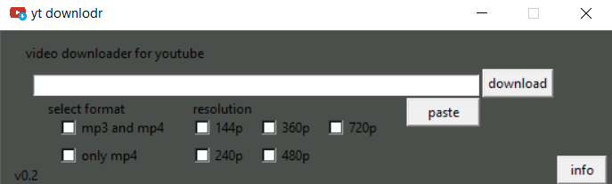

youtube downloader made in python 3

will be adding more features

install the required packages by doing "pip install -r requirements.txt" before running the script\
written in python 3.7.4

for running the script:

on windows:
    clone or download repo onto a folder
    open cmd and navigate to the folder where you have the repo cloned
    do:
    pip install -r requirements.txt
    python3 main.py (if you have multiple versions of python installed)
             or
    python main.py
pytube documentation included for better reference

follow me on:
[Instagram](https://instagram.com/coder_arena)

and consider subscribing here:
[subscribe](https://www.youtube.com/channel/UCqmAMwECiUUokMpI03othpQ)

IMPORTANT:
    note that this works only with pytube3 and not the default pytube package
    (ignore if you are installing packages from the requirements.txt method mentioned above )